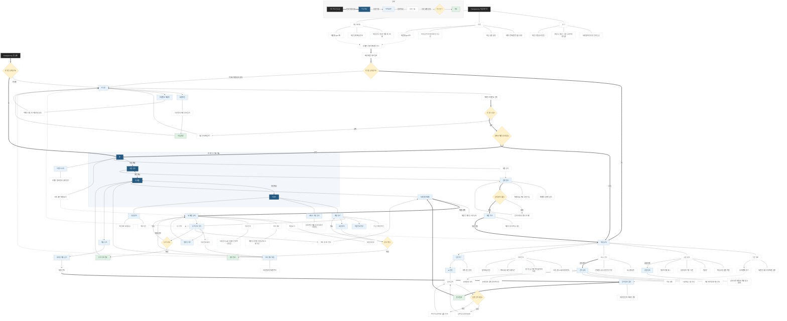

# Transparency. 상세 사용자 흐름

사용자가 추가로 제공한 원본 기획입니다. 로그인·가입·QR 링크·AI 등 미구현 기능을 포함하며, 구현 완료 목록이 아닙니다.

```mermaid
flowchart TD
    start["Transparency. 앱 실행"] ==> session{"로그인 상태 유지?"}
    session -->|"아니요"| login["로그인"]
    session ==>|"예"| home["홈"]

    login --- fields["이메일·비밀번호 입력"]
    fields ==> auth{"로그인 성공?"}
    auth -->|"실패"| error["오류 안내·재입력"]
    error --> login
    auth ==>|"성공"| destination{"접속한 제품 링크 있음?"}
    destination ==>|"없음"| home
    destination ==>|"있음"| productDetail

    login --> signup["회원가입"]
    signup --- signupInfo["약관 동의·계정 정보 입력"]
    signupInfo --> joined["가입 완료"]
    joined --> login

    login --> reset["비밀번호 재설정"]
    reset --- verify["이메일 인증·새 비밀번호 설정"]
    verify --> login

    subgraph appMenu["로그인 후 주요 메뉴"]
        home["홈"]
        explore["제품 탐색"]
        my["내 제품"]
        more["더보기"]
    end

    home <-->|"하단 메뉴"| explore
    explore <-->|"하단 메뉴"| my
    my <-->|"하단 메뉴"| more

    home --- homeSearch["제품 검색"]
    homeSearch -.-> search
    home --- summary["사용 중인 제품 요약"]
    summary -.-> myDetail
    home --- brand["브랜드 소개"]
    brand --- brandInfo["브랜드 철학·정보 공개 원칙"]

    explore --- search["검색·필터"]
    search --- keyword["제품명·성분명 검색"]
    search --- filter["제품 종류·주요 성분·기능"]
    search ==> results{"검색 결과 있음?"}
    results -->|"없음"| empty["검색어 변경·필터 초기화"]
    empty --> search
    results ==>|"있음"| productList["제품 목록"]
    productList --- listInfo["제품명·용량·핵심 성분"]
    productList ==>|"제품 선택"| productDetail["제품 상세"]

    productDetail --- basic["기본 정보"]
    basic --- basicInfo["제품명·종류·용량·제품 설명"]
    basic --> add["내 제품에 추가"]
    add -.-> registration

    productDetail --- ingredient["성분·함량"]
    ingredient --- coreIngredient["핵심 성분·함량·역할"]
    ingredient --- fullIngredient["전성분"]
    ingredient --- ingredientBasis["함량 설정 이유·기준"]
    ingredient --- disclosure["미공개 정보 표시"]
    ingredient -->|"성분 선택"| ingredientDetail["성분 상세"]
    ingredientDetail --- ingredientDescription["성분 설명·제품 내 역할·참고 출처"]

    productDetail --- evidence["효능·근거"]
    evidence --- effect["효능별 설명"]
    evidence --- evidenceType["완제품 시험·성분 연구 구분"]
    evidence ==>|"근거 확인"| evidenceDetail["근거 상세"]
    evidenceDetail --- research["자료 제목·발행기관·연도"]
    evidenceDetail --- condition["시험 대상·기간·조건"]
    evidenceDetail --- result["주요 결과"]
    evidenceDetail --- limitation["한계·적용 범위·정보 확인일"]
    evidenceDetail --> original["출처·원문 보기"]

    productDetail --- productGuide["사용 안내"]
    productGuide --- routine["사용 순서·1회 사용량·빈도"]
    productGuide --- remaining["용기 눈금·잔량 확인·끝까지 사용"]
    productGuide --- caution["주의사항·보관·사용기간"]
    productGuide --- productDisposal["분리배출 방법"]

    productDetail --> question["질문하기"]
    question --- faq["자주 묻는 질문"]
    question --> ai["AI 질문"]
    ai --- questionInput["질문 입력"]
    questionInput --> available{"답변 근거 있음?"}
    available -->|"있음"| answer["답변·참고 정보·출처"]
    available -->|"없음"| unavailable["확인 가능한 자료 없음 안내"]
    answer --> questionInput
    unavailable --> questionInput

    my --- active["사용 중인 제품"]
    my --- completed["사용 완료 제품"]
    my --> register["제품 등록"]

    register --> registerSearch["등록할 제품 검색"]
    registerSearch --> selectProduct["제품 선택"]
    selectProduct ==> registration["등록 정보 입력"]
    registration --- opened["개봉일 입력·미개봉 선택"]
    registration ==> saved["등록 완료"]
    saved ==> active

    active --- activeInfo["제품명·개봉일·사용 상태"]
    completed --- completedInfo["사용 완료한 제품 목록"]
    active ==>|"제품 선택"| myDetail["내 제품 상세"]
    completed -->|"제품 선택"| myDetail

    myDetail --- overview["제품 요약"]
    overview --- overviewInfo["제품명·용량"]
    overview -.-> productDetail

    myDetail --- usageStatus["사용 정보"]
    usageStatus --- statusInfo["개봉일·경과일·사용 상태·사용기간"]
    myDetail --- myGuide["사용 안내"]
    myGuide --- myGuideInfo["사용 순서·1회 사용량·잔량 확인 방법"]

    myDetail --> manage["등록 정보 관리"]
    manage --> editDate["개봉일 수정"]
    editDate --> myDetail
    manage --> finish["사용 완료 처리"]
    finish --> completed
    manage --> resume["사용 중으로 변경"]
    resume --> active
    manage --> remove{"등록 삭제?"}
    remove -->|"취소"| myDetail
    remove -->|"확인"| removed["등록 삭제 완료"]
    removed --> my

    more --- account["계정 관리"]
    account --- accountInfo["가입 이메일 확인"]
    account --> changePassword["비밀번호 변경"]
    account --> logout["로그아웃"]
    logout -.-> login
    account --> withdraw["회원 탈퇴"]
    withdraw --> withdrawConfirm{"탈퇴 확인?"}
    withdrawConfirm -->|"취소"| account
    withdrawConfirm -->|"확인"| withdrawn["탈퇴 완료"]
    withdrawn -.-> login

    more --- help["서비스 이용 안내"]
    help --- helpInfo["정보 확인·제품 등록·사용 관리 방법"]
    more --- policy["약관·정책"]
    policy --- terms["이용약관"]
    policy --- privacy["개인정보 처리방침"]

    physical["Transparency. 제품·패키지"] --- bottle["용기"]
    physical --- label["라벨"]
    physical --- box["외부 패키지"]

    bottle --- visibility["내용물 확인 부분·잔량 눈금"]
    bottle --- bottleUse["배출부·여닫는 부분·1회 사용량 기준"]
    bottle --- material["재질·부품 분리 방법"]

    label --- identity["브랜드명·제품명·종류·용량"]
    label --- labelCore["핵심 성분·함량"]
    label --- labelGuide["사용법·주의사항·개봉일 기입란"]
    label --- labelQr["제품별 QR 코드"]

    box --- boxInfo["제품 정보·전성분·제품 표시사항"]
    box --- boxDisposal["재질·분리배출 안내"]
    box --- boxQr["제품별 QR 코드"]

    labelQr -.-> camera["휴대폰 기본 카메라로 인식"]
    boxQr -.-> camera
    camera ==> productLink["해당 제품 링크 접속"]
    productLink ==> qrSession{"로그인 상태 유지?"}
    qrSession ==>|"예"| productDetail
    qrSession -->|"아니요·제품 링크 유지"| login

    subgraph legend["범례"]
        legendEntry["시작·외부 진입점"]
        legendMain["주요 메뉴"]
        legendScreen["하위 화면"]
        legendInfo["정보·기능"]
        legendDecision{"조건 분기"}
        legendSuccess["완료"]
        legendEntry ==>|"주요 이용 흐름"| legendMain
        legendMain -->|"일반 이동"| legendScreen
        legendScreen ---|"정보 포함"| legendInfo
        legendInfo -.->|"다른 화면 연결"| legendDecision
        legendDecision --> legendSuccess
    end

    classDef entry fill:#252525,stroke:#252525,color:#FFFFFF
    classDef main fill:#245A81,stroke:#194665,color:#FFFFFF
    classDef screen fill:#E8F2FA,stroke:#8BAFC9,color:#18384F
    classDef info fill:#FFFFFF,stroke:#C8CDD3,color:#333333
    classDef decision fill:#FFF2CC,stroke:#C6A247,color:#574415
    classDef success fill:#E1F1E5,stroke:#6A9F78,color:#254F30

    class start,physical,legendEntry entry
    class home,explore,my,more,legendMain main
    class login,signup,reset,brand,search,productList,productDetail,ingredientDetail,evidenceDetail,question,ai,active,completed,register,registerSearch,registration,myDetail,manage,editDate,account,changePassword,withdraw,help,policy,legendScreen screen
    class session,auth,destination,results,available,remove,withdrawConfirm,qrSession,legendDecision decision
    class joined,saved,removed,withdrawn,legendSuccess success
    class fields,error,signupInfo,verify,homeSearch,summary,brandInfo,keyword,filter,empty,listInfo,basic,basicInfo,add,ingredient,coreIngredient,fullIngredient,ingredientBasis,disclosure,ingredientDescription,evidence,effect,evidenceType,research,condition,result,limitation,original,productGuide,routine,remaining,caution,productDisposal,faq,questionInput,answer,unavailable,selectProduct,opened,activeInfo,completedInfo,overview,overviewInfo,usageStatus,statusInfo,myGuide,myGuideInfo,finish,resume,accountInfo,logout,helpInfo,terms,privacy,bottle,label,box,visibility,bottleUse,material,identity,labelCore,labelGuide,labelQr,boxInfo,boxDisposal,boxQr,camera,productLink,legendInfo info

    style appMenu fill:#F3F6FA,stroke:#BAC8D5
    style legend fill:#F7F7F7,stroke:#CCCCCC
```
