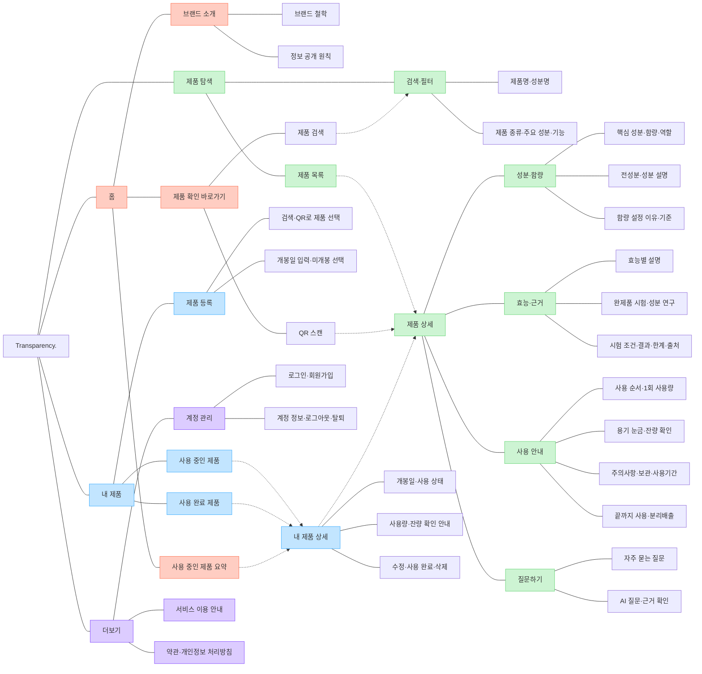

# Transparency. 화면 정보 구조

사용자가 제공한 원본 기획입니다. 아래 구조 전체의 구현이 완료되었다는 뜻은 아닙니다. 현재 범위는 [인계 기록](project-handoff.md)을 확인하세요.

```mermaid
flowchart LR
    app["Transparency."] --- home["홈"]
    app --- explore["제품 탐색"]
    app --- my["내 제품"]
    app --- more["더보기"]
    home --- brand["브랜드 소개"]
    brand --- philosophy["브랜드 철학"]
    brand --- principle["정보 공개 원칙"]
    home --- quick["제품 확인 바로가기"]
    quick --- qr["QR 스캔"]
    quick --- searchLink["제품 검색"]
    home --- summary["사용 중인 제품 요약"]
    explore --- search["검색·필터"]
    search --- keyword["제품명·성분명"]
    search --- filter["제품 종류·주요 성분·기능"]
    explore --- list["제품 목록"]
    list -.-> detail["제품 상세"]
    detail --- ingredient["성분·함량"]
    ingredient --- core["핵심 성분·함량·역할"]
    ingredient --- full["전성분·성분 설명"]
    ingredient --- basis["함량 설정 이유·기준"]
    detail --- evidence["효능·근거"]
    evidence --- effect["효능별 설명"]
    evidence --- research["완제품 시험·성분 연구"]
    evidence --- source["시험 조건·결과·한계·출처"]
    detail --- guide["사용 안내"]
    guide --- routine["사용 순서·1회 사용량"]
    guide --- remaining["용기 눈금·잔량 확인"]
    guide --- caution["주의사항·보관·사용기간"]
    guide --- disposal["끝까지 사용·분리배출"]
    detail --- question["질문하기"]
    question --- faq["자주 묻는 질문"]
    question --- ai["AI 질문·근거 확인"]
    my --- register["제품 등록"]
    register --- select["검색·QR로 제품 선택"]
    register --- date["개봉일 입력·미개봉 선택"]
    my --- active["사용 중인 제품"]
    my --- complete["사용 완료 제품"]
    active -.-> myDetail["내 제품 상세"]
    complete -.-> myDetail
    myDetail --- status["개봉일·사용 상태"]
    myDetail --- usage["사용량·잔량 확인 안내"]
    myDetail --- edit["수정·사용 완료·삭제"]
    more --- account["계정 관리"]
    account --- login["로그인·회원가입"]
    account --- accountSetting["계정 정보·로그아웃·탈퇴"]
    more --- help["서비스 이용 안내"]
    more --- policy["약관·개인정보 처리방침"]
    qr -.-> detail
    searchLink -.-> search
    summary -.-> myDetail
    myDetail -.-> detail
    classDef homeColor fill:#FFCDC2,stroke:#FF7556
    classDef productColor fill:#CDF4D3,stroke:#66D575
    classDef myColor fill:#C2E5FF,stroke:#3DADFF
    classDef moreColor fill:#DCCCFF,stroke:#874FFF
    class home,brand,quick,summary homeColor
    class explore,search,list,detail,ingredient,evidence,guide,question productColor
    class my,register,active,complete,myDetail myColor
    class more,account,help,policy moreColor
```
